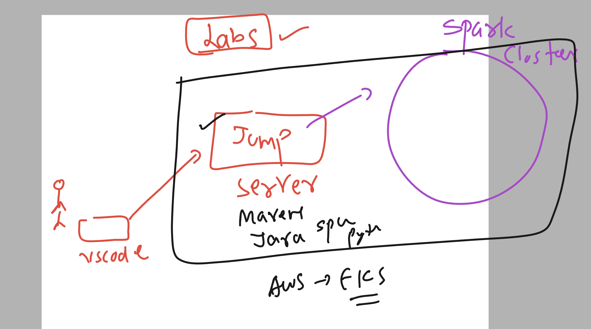

## thing you need to know 

## Training timings 

## labsetup details 

### Installing vscode pluing and connection with ssh plung 

[click_here](https://www.youtube.com/watch?v=2M_50-VAUJA)

### Bigdata spark blogspot 

[click_here](https://slashbigdata.blogspot.com/)

