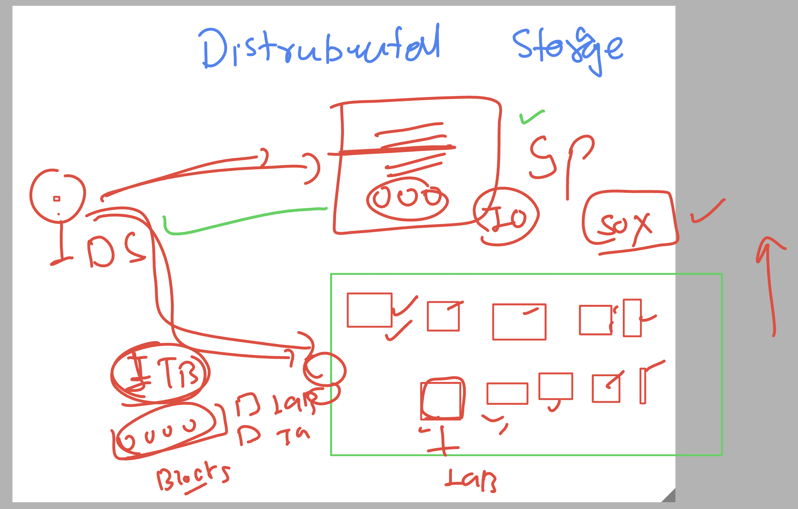
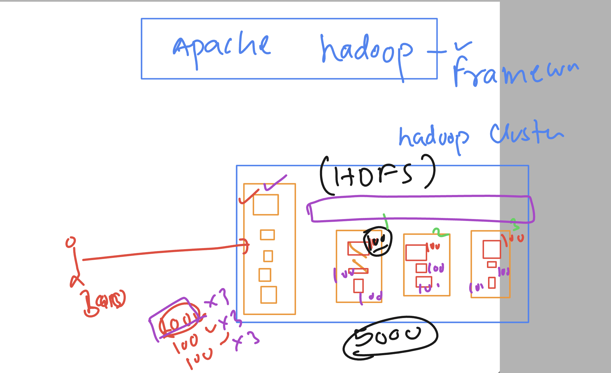
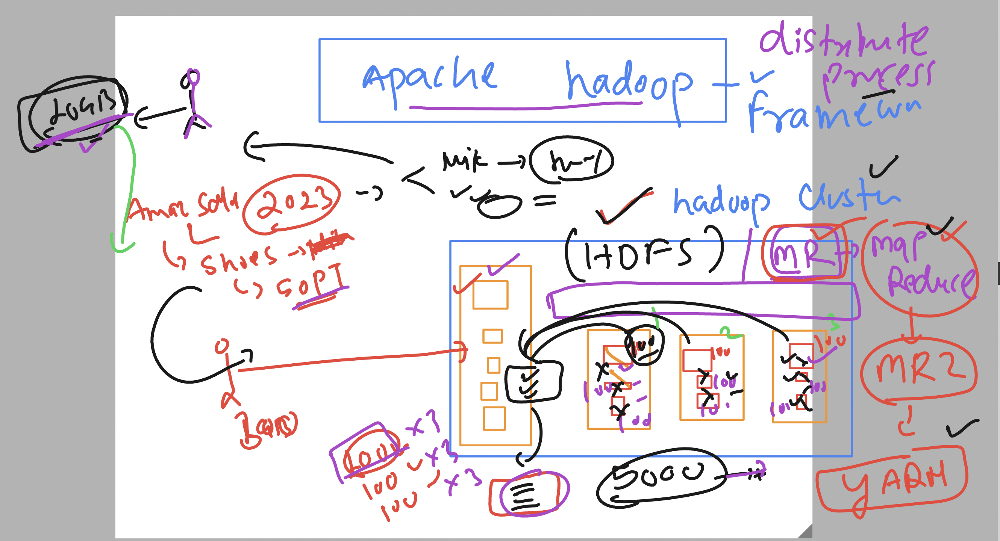
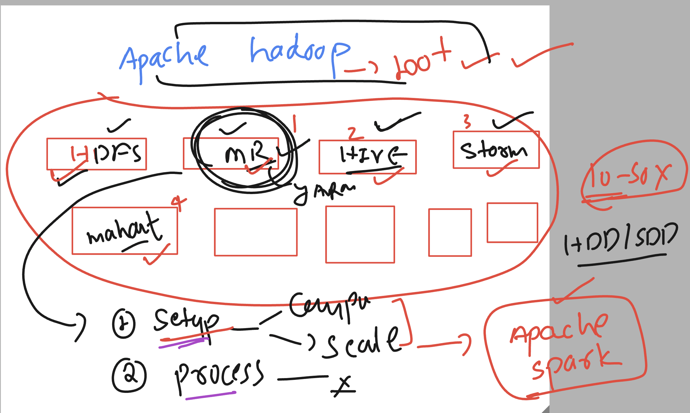
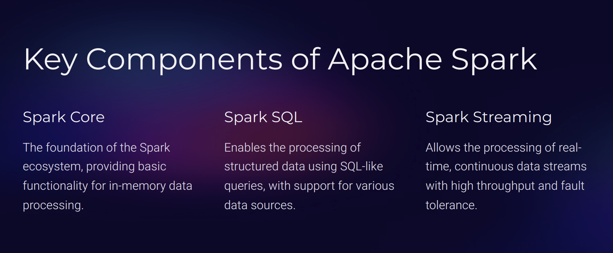
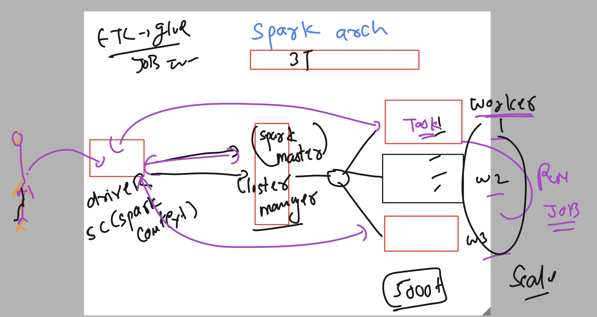
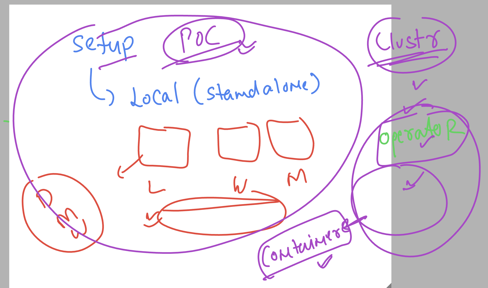
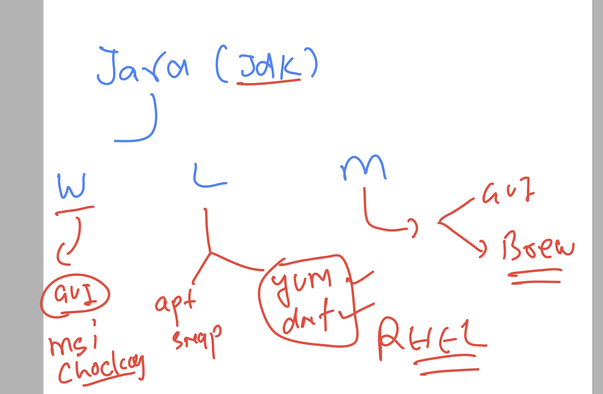

# apache spark 

### data problem understanding -- storage & processing 


### the distributed storage intro 



### Introduction hadoop framework -- HDFS 



## Distributed process by hadoop framework project -- MR \ YARN 



## Introducing apache spark 



## key components 



## apache spark 3T architecture 



### 3 type of setup in apache spark we can do 



## setup spark stand alone in single linux machine 

### login with root / admin user 

```
ec2-user@ip-172-31-33-162 ~]$ sudo -i
[root@ip-172-31-33-162 ~]# whoami
root
[root@ip-172-31-33-162 ~]# 

```

### changing hostname for better identification 

```
 hostnamectl set-hostname  ashu-spark-machine 
[root@ip-172-31-33-162 ~]# exit
logout
[ec2-user@ip-172-31-33-162 ~]$ sudo -i
[root@ashu-spark-machine ~]# 

```
### setup of jdk 



### Installing jdk 17 in RHEL /amaon linux / oracle linux 

```
dnf install java-17*

```

### verify 

```
java --version 
openjdk 17.0.12 2024-07-16 LTS
OpenJDK Runtime Environment Corretto-17.0.12.7.1 (build 17.0.12+7-LTS)
OpenJDK 64-Bit Server VM Corretto-17.0.12.7.1 (build 17.0.12+7-LTS, mixed mode, sharing)

===>

[root@ashu-spark-machine ~]# jps
27069 Jps

```

### Download spark 3.x bin 

[click_here](https://spark.apache.org/downloads.html)

```
 wget https://dlcdn.apache.org/spark/spark-3.5.3/spark-3.5.3-bin-hadoop3.tgz


--2024-10-07 07:22:53--  https://dlcdn.apache.org/spark/spark-3.5.3/spark-3.5.3-bin-hadoop3.tgz
Resolving dlcdn.apache.org (dlcdn.apache.org)... 151.101.2.132, 2a04:4e42::644
Connecting to dlcdn.apache.org (dlcdn.apache.org)|151.101.2.132|:443... connected.
HTTP request sent, awaiting response... 200 OK
Length: 400864419 (382M) [application/x-gzip]
Saving to: ‘spark-3.5.3-bin-hadoop3.tgz’

spark-3.5.3-bin-hadoop3.tgz        100%[=============================================================>] 382.29M   119MB/s    in 3.2s    

2024-10-07 07:22:57 (120 MB/s) - ‘spark-3.5.3-bin-hadoop3.tgz’ saved [400864419/400864419]


====>>

[root@ashu-spark-machine ~]# ls
spark-3.5.3-bin-hadoop3.tgz
[root@ashu-spark-machine ~]# 

```

### Extract to bins

```
tar xvzf spark-3.5.3-bin-hadoop3.tgz 

```

### copy to some directory i choose /opt

```
 mv spark-3.5.3-bin-hadoop3 /opt/spark35

[root@ashu-spark-machine ~]# cd /opt/spark35/

[root@ashu-spark-machine spark35]# ls
LICENSE  NOTICE  R  README.md  RELEASE  bin  conf  data  examples  jars  kubernetes  licenses  python  sbin  yarn
[root@ashu-spark-machine spark35]# 

```