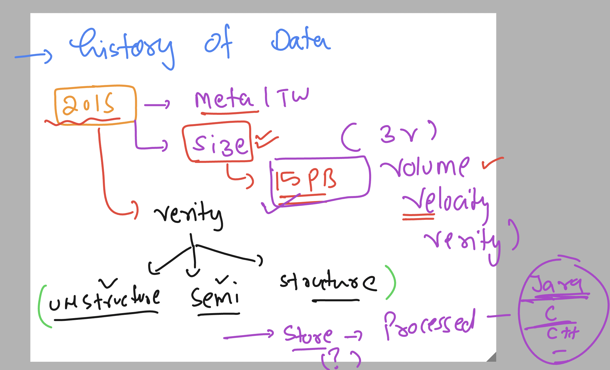

# apache spark 

### data problem understanding -- storage & processing 



### the distributed storage intro 


### Introduction hadoop framework -- HDFS 


## Distributed process by hadoop framework project -- MR \ YARN 


## Introducing apache spark 


## key components 


## apache spark 3T architecture 


### 3 type of setup in apache spark we can do 


## setup spark stand alone in single linux machine 

### login with root / admin user 

```
ec2-user@ip-172-31-33-162 ~]$ sudo -i
[root@ip-172-31-33-162 ~]# whoami
root
[root@ip-172-31-33-162 ~]# 

```

### changing hostname for better identification 

```
 hostnamectl set-hostname  ashu-spark-machine 
[root@ip-172-31-33-162 ~]# exit
logout
[ec2-user@ip-172-31-33-162 ~]$ sudo -i
[root@ashu-spark-machine ~]# 

```
### setup of jdk 


### Installing jdk 17 in RHEL /amaon linux / oracle linux 

```
dnf install java-17*

```

### verify 

```
java --version 
openjdk 17.0.12 2024-07-16 LTS
OpenJDK Runtime Environment Corretto-17.0.12.7.1 (build 17.0.12+7-LTS)
OpenJDK 64-Bit Server VM Corretto-17.0.12.7.1 (build 17.0.12+7-LTS, mixed mode, sharing)

===>

[root@ashu-spark-machine ~]# jps
27069 Jps

```

### Download spark 3.x bin 

[click_here](https://spark.apache.org/downloads.html)

```
 wget https://dlcdn.apache.org/spark/spark-3.5.3/spark-3.5.3-bin-hadoop3.tgz


--2024-10-07 07:22:53--  https://dlcdn.apache.org/spark/spark-3.5.3/spark-3.5.3-bin-hadoop3.tgz
Resolving dlcdn.apache.org (dlcdn.apache.org)... 151.101.2.132, 2a04:4e42::644
Connecting to dlcdn.apache.org (dlcdn.apache.org)|151.101.2.132|:443... connected.
HTTP request sent, awaiting response... 200 OK
Length: 400864419 (382M) [application/x-gzip]
Saving to: ‘spark-3.5.3-bin-hadoop3.tgz’

spark-3.5.3-bin-hadoop3.tgz        100%[=============================================================>] 382.29M   119MB/s    in 3.2s    

2024-10-07 07:22:57 (120 MB/s) - ‘spark-3.5.3-bin-hadoop3.tgz’ saved [400864419/400864419]


====>>

[root@ashu-spark-machine ~]# ls
spark-3.5.3-bin-hadoop3.tgz
[root@ashu-spark-machine ~]# 

```

### Extract to bins

```
tar xvzf spark-3.5.3-bin-hadoop3.tgz 

```

### copy to some directory i choose /opt

```
 mv spark-3.5.3-bin-hadoop3 /opt/spark35

[root@ashu-spark-machine ~]# cd /opt/spark35/

[root@ashu-spark-machine spark35]# ls
LICENSE  NOTICE  R  README.md  RELEASE  bin  conf  data  examples  jars  kubernetes  licenses  python  sbin  yarn
[root@ashu-spark-machine spark35]# 

```

### conf directory 

```
cd conf/
[root@ashu-spark-machine conf]# ls
fairscheduler.xml.template  metrics.properties.template   spark-env.sh.template
log4j2.properties.template  spark-defaults.conf.template  workers.template


[root@ashu-spark-machine conf]# cp spark-defaults.conf.template  spark-defaults.conf
[root@ashu-spark-machine conf]# ls
fairscheduler.xml.template  metrics.properties.template  spark-defaults.conf.template  workers.template
log4j2.properties.template  spark-defaults.conf          spark-env.sh.template


[root@ashu-spark-machine conf]# cat spark-defaults.conf
#
# Licensed to the Apache Software Foundation (ASF) under one or more
# contributor license agreements.  See the NOTICE file distributed with
# this work for additional information regarding copyright ownership.
# The ASF licenses this file to You under the Apache License, Version 2.0
# (the "License"); you may not use this file except in compliance with
# the License.  You may obtain a copy of the License at
#
#    http://www.apache.org/licenses/LICENSE-2.0
#
# Unless required by applicable law or agreed to in writing, software
# distributed under the License is distributed on an "AS IS" BASIS,
# WITHOUT WARRANTIES OR CONDITIONS OF ANY KIND, either express or implied.
# See the License for the specific language governing permissions and
# limitations under the License.
#

# Default system properties included when running spark-submit.
# This is useful for setting default environmental settings.

# Example:
# spark.master                     spark://master:7077
# spark.eventLog.enabled           true
# spark.eventLog.dir               hdfs://namenode:8021/directory

```

## Interaction with spark 

- **live** 
- **jobs** 

### Interaction with scala interface 

```
cd /opt/spark35/
[root@ashu-spark-machine spark35]# ls
LICENSE  NOTICE  R  README.md  RELEASE  bin  conf  data  examples  jars  kubernetes  licenses  python  sbin  yarn
[root@ashu-spark-machine spark35]# 

[root@ashu-spark-machine spark35]# ./bin/spark-shell 
Setting default log level to "WARN".
To adjust logging level use sc.setLogLevel(newLevel). For SparkR, use setLogLevel(newLevel).
24/10/07 07:40:34 WARN NativeCodeLoader: Unable to load native-hadoop library for your platform... using builtin-java classes where applicable
Spark context Web UI available at http://ip-172-31-33-162.ap-south-1.compute.internal:4040
Spark context available as 'sc' (master = local[*], app id = local-1728286835677).
Spark session available as 'spark'.
Welcome to
      ____              __
     / __/__  ___ _____/ /__
    _\ \/ _ \/ _ `/ __/  '_/
   /___/ .__/\_,_/_/ /_/\_\   version 3.5.3
      /_/
         
Using Scala version 2.12.18 (OpenJDK 64-Bit Server VM, Java 17.0.12)
Type in expressions to have them evaluated.
Type :help for more information.

scala> 

```

### for easy admin / dev practise setup ENV 

```
root@ashu-spark-machine spark35]# SPARK_HOME=/opt/spark35/
[root@ashu-spark-machine spark35]# PATH=$PATH:$SPARK_HOME/bin:$SPARK_HOME/sbin
[root@ashu-spark-machine spark35]# export PATH 
[root@ashu-spark-machine spark35]# 

```

### to make it permanent 

```
[root@ashu-spark-machine spark35]# echo SPARK_HOME=/opt/spark35/ >>~/.bashrc 
[root@ashu-spark-machine spark35]# 
[root@ashu-spark-machine spark35]# echo PATH=$PATH:$SPARK_HOME/bin:$SPARK_HOME/sbin >>~/.bashrc 

[root@ashu-spark-machine spark35]# echo export PATH   >>~/.bashrc 
[root@ashu-spark-machine spark35]# 
```

### close session of machine and relogin to verify

```
 sudo -i
[root@ashu-spark-machine ~]# 
[root@ashu-spark-machine ~]# spark-shell 
Setting default log level to "WARN".
To adjust logging level use sc.setLogLevel(newLevel). For SparkR, use setLogLevel(newLevel).
24/10/07 07:46:59 WARN NativeCodeLoader: Unable to load native-hadoop library for your platform... using builtin-java classes where applicable
Spark context Web UI available at http://ip-172-31-33-162.ap-south-1.compute.internal:4040
Spark context available as 'sc' (master = local[*], app id = local-1728287220378).
Spark session available as 'spark'.
Welcome to
      ____              __
     / __/__  ___ _____/ /__
    _\ \/ _ \/ _ `/ __/  '_/
   /___/ .__/\_,_/_/ /_/\_\   version 3.5.3
      /_/
         
Using Scala version 2.12.18 (OpenJDK 64-Bit Server VM, Java 17.0.12)
Type in expressions to have them evaluated.
Type :help for more information.

scala> :quit

```
