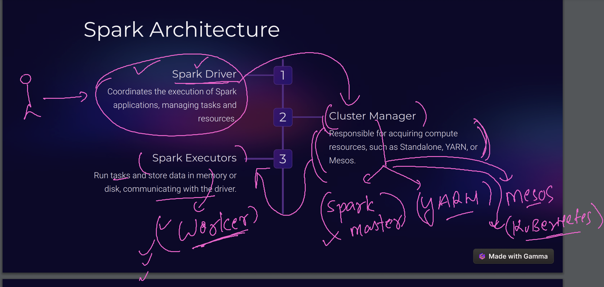
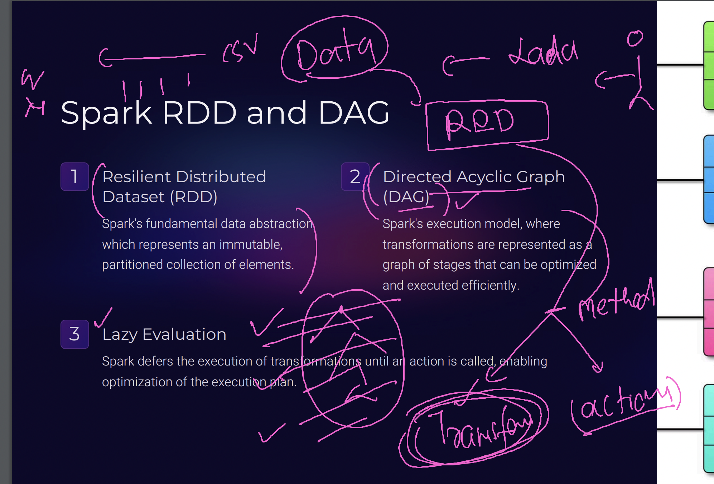
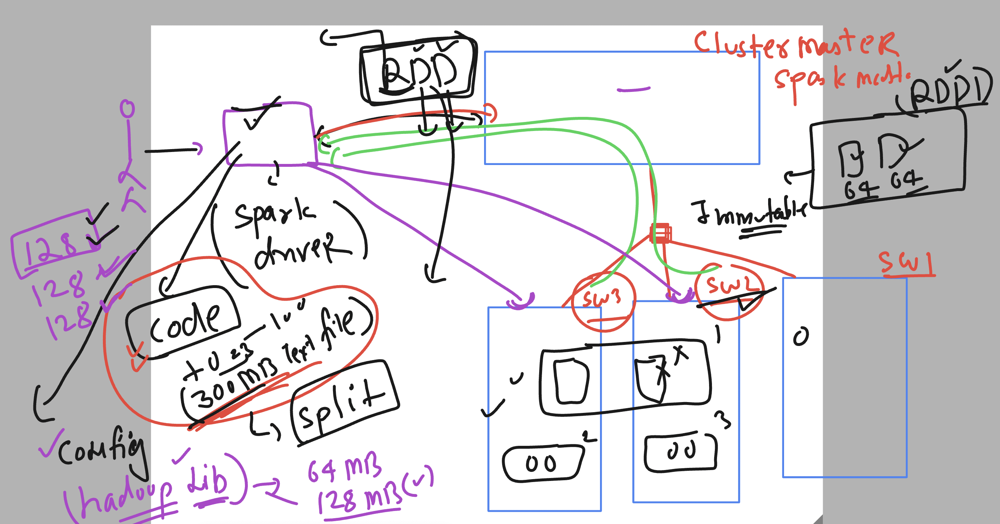
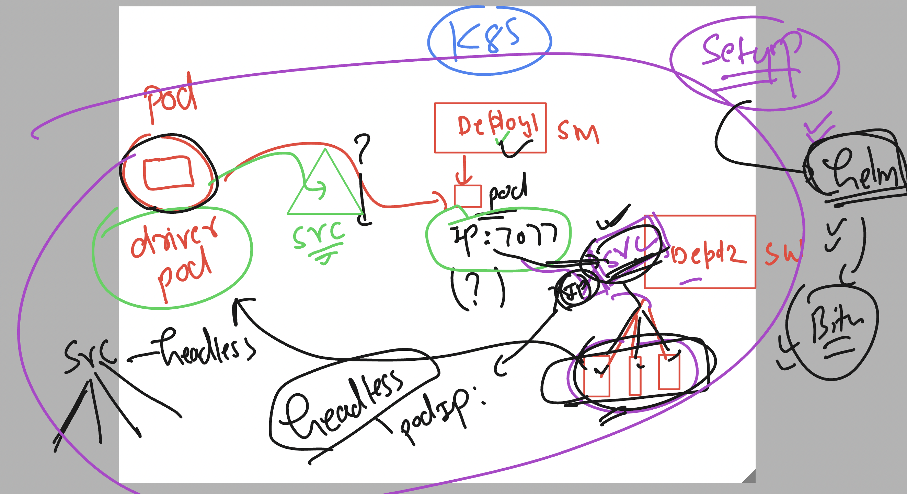
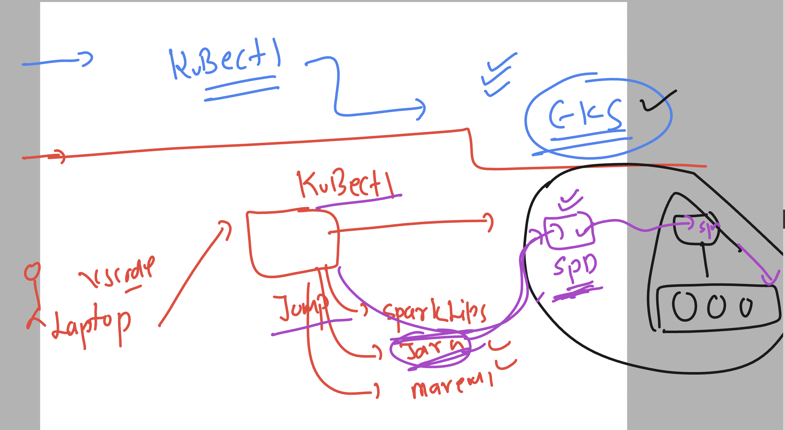

## spark revision 



### RDD , DAG , lazy evalution 



## RDD concepts and partitions of it 



### RDD transformation types 


### verify spark_home variable 

```
ec2-user@ashu-spark-machine ~]$ sudo -i
[root@ashu-spark-machine ~]# echo $SPARK_HOME
/opt/spark35/
[root@ashu-spark-machine ~]# 

```
## start spark master and worker 

```
root@ashu-spark-machine ~]# start-master.sh 
org.apache.spark.deploy.master.Master running as process 4046.  Stop it first.

[root@ashu-spark-machine ~]# start-worker.sh   spark://172.31.33.162:7077
org.apache.spark.deploy.worker.Worker running as process 4130.  Stop it first.

[root@ashu-spark-machine ~]# netstat -nlpt
Active Internet connections (only servers)
Proto Recv-Q Send-Q Local Address           Foreign Address         State       PID/Program name    
tcp        0      0 0.0.0.0:22              0.0.0.0:*               LISTEN      2253/sshd: /usr/sbi 
tcp        0      0 127.0.0.1:36325         0.0.0.0:*               LISTEN      2088/containerd     
tcp6       0      0 172.31.33.162:7077      :::*                    LISTEN      4046/java           
tcp6       0      0 :::22                   :::*                    LISTEN      2253/sshd: /usr/sbi 
tcp6       0      0 :::8080                 :::*                    LISTEN      4046/java           
tcp6       0      0 :::8081                 :::*                    LISTEN      4130/java           
tcp6       0      0 172.31.33.162:42199     :::*                    LISTEN      4130/java       

```

### allow ssh with password 

```
 passwd ec2-user
Changing password for user ec2-user.
New password: 
BAD PASSWORD: The password is shorter than 8 characters
Retype new password: 
passwd: all authentication tokens updated successfully.
[root@ashu-spark-machine ~]# 
[root@ashu-spark-machine ~]# 
[root@ashu-spark-machine ~]# 
[root@ashu-spark-machine ~]# nano /etc/ssh/sshd_config 
[root@ashu-spark-machine ~]# 
[root@ashu-spark-machine ~]# systemctl restart sshd 
[root@ashu-spark-machine ~]# 

```

### giving acess to ec2-user of apache spark 

```
[ec2-user@ashu-spark-machine ~]$ echo SPARK_HOME=/opt/spark35/ >>~/.bashrc 
[ec2-user@ashu-spark-machine ~]$ echo PATH=$PATH:$SPARK_HOME/bin:$SPARK_HOME/sbin >>~/.bashrc 
[ec2-user@ashu-spark-machine ~]$ echo export PATH   >>~/.bashrc 
[ec2-user@ashu-spark-machine ~]$ 
[ec2-user@ashu-spark-machine ~]$ source  ~/.bashrc 
[ec2-user@ashu-spark-machine ~]$ 

```
### sample RDD transformation and action  in scala 

```
Using Scala version 2.12.18 (OpenJDK 64-Bit Server VM, Java 17.0.12)
Type in expressions to have them evaluated.
Type :help for more information.

scala> val  ashu_numbers = Seq(1,3,6,8,10)
ashu_numbers: Seq[Int] = List(1, 3, 6, 8, 10)

scala> val rdd1 = sc.parallelize(ashu_numbers)
rdd1: org.apache.spark.rdd.RDD[Int] = ParallelCollectionRDD[0] at parallelize at <console>:24

scala> val rdd2 = rdd1.map(x => x*5)
rdd2: org.apache.spark.rdd.RDD[Int] = MapPartitionsRDD[1] at map at <console>:23

scala> val result = rdd2.collect()
result: Array[Int] = Array(5, 15, 30, 40, 50)


```

### lets do in java build using maven 

```
 mvn clean package 
[INFO] Scanning for projects...
[INFO] 
[INFO] -----------------------< com.example:ashucode1 >------------------------
[INFO] Building ashucode1 1.0-SNAPSHOT
[INFO] --------------------------------[ jar ]---------------------------------
[INFO] 
[INFO] --- maven-clean-plugin:2.5:clean (default-clean) @ ashucode1 ---
[INFO] Deleting /home/ec2-user/ashu_codes/ashucode1/target
[INFO] 
[INFO] --- maven-resources-plugin:2.6:resources (default-resources) @ ashucode1 ---
[WARNING] Using platform encoding (UTF-8 actually) to copy filtered resources, i.e. build is platform dependent!
[INFO] Copying 0 resource
[INFO] 
[INFO] --- maven-compiler-plugin:3.8.1:compile (default-compile) @ ashucode1 ---
[INFO] Changes detected - recompiling the module!
[WARNING] File encoding has not been set, using platform encoding UTF-8, i.e. build is platform dependent!
[INFO] Compiling 1 source file to /home/ec2-user/ashu_codes/ashucode1/target/classes
[INFO] 
[INFO] --- maven-resources-plugin:2.6:testResources (default-testResources) @ ashucode1 ---
[WARNING] Using platform encoding (UTF-8 actually) to copy filtered resources, i.e. build is platform dependent!
[INFO] skip non existing resourceDirectory /home/ec2-user/ashu_codes/ashucode1/src/test/resources
[INFO] 
[INFO] --- maven-compiler-plugin:3.8.1:testCompile (default-testCompile) @ ashucode1 ---
[INFO] Changes detected - recompiling the module!
[WARNING] File encoding has not been set, using platform encoding UTF-8, i.e. build is platform dependent!
[INFO] 
[INFO] --- maven-surefire-plugin:2.12.4:test (default-test) @ ashucode1 ---
[INFO] 
[INFO] --- maven-jar-plugin:2.4:jar (default-jar) @ ashucode1 ---
[INFO] Building jar: /home/ec2-user/ashu_codes/ashucode1/target/ashucode1-1.0-SNAPSHOT.jar
[INFO] ------------------------------------------------------------------------
[INFO] BUILD SUCCESS
[INFO] ------------------------------------------------------------------------
[INFO] Total time:  3.992 s
[INFO] Finished at: 2024-10-08T09:27:28Z

===>

ls
pom.xml  src  target
[ec2-user@ashu-spark-machine ashucode1]$ ls target/
ashucode1-1.0-SNAPSHOT.jar  classes  generated-sources  generated-test-sources  maven-archiver  maven-status  test-classes
[ec2-user@ashu-spark-machine ashucode1]$ 
```

### submit java jar to apache spark 

```
 spark-submit  --class com.example.Ashucode1  target/ashucode1-1.0-SNAPSHOT.jar

```

### to clean the build 

```
ls
pom.xml  src  target
[ec2-user@ashu-spark-machine ashucode1]$ mvn clean 
[INFO] Scanning for projects...
[INFO] 
[INFO] -----------------------< com.example:ashucode1 >------------------------
[INFO] Building ashucode1 1.0-SNAPSHOT
[INFO] --------------------------------[ jar ]---------------------------------
[INFO] 
[INFO] --- maven-clean-plugin:2.5:clean (default-clean) @ ashucode1 ---
[INFO] Deleting /home/ec2-user/ashu_codes/ashucode1/target
[INFO] ------------------------------------------------------------------------
[INFO] BUILD SUCCESS
[INFO] ------------------------------------------------------------------------
[INFO] Total time:  0.301 s
[INFO] Finished at: 2024-10-08T09:50:12Z
[INFO] ------------------------------------------------------------------------
[ec2-user@ashu-spark-machine ashucode1]$ ls
pom.xml  src
[ec2-user@ashu-spark-machine ashucode1]$ 

```

### setup of apache spark using helm 



### spark with Eks setup overview 



## Install kubectl eks client 

```
cat <<EOF | sudo tee /etc/yum.repos.d/kubernetes.repo
[kubernetes]
name=Kubernetes
baseurl=https://pkgs.k8s.io/core:/stable:/v1.31/rpm/
enabled=1
gpgcheck=1
gpgkey=https://pkgs.k8s.io/core:/stable:/v1.31/rpm/repodata/repomd.xml.key
EOF

====>

yum install kubectl 

===>

kubectl  version --client 
Client Version: v1.31.1
Kustomize Version: v5.4.2

```

### Eksctl install 

```
 curl --silent --location "https://github.com/weaveworks/eksctl/releases/latest/download/eksctl_$(uname -s)_amd64.tar.gz" | tar xz -C /usr/bin/

 ===>>
 eksctl version 
0.191.0

```

### configure aws cred 

```
aws configure 

```

### get cluster list 

```
eksctl  get cluster 
NAME                    REGION          EKSCTL CREATED
delvex-cluster-new      us-east-1       True

===> get EKS creds 

[ec2-user@ashu-spark-machine ashucode1]$ aws eks update-kubeconfig --name delvex-cluster-new  --region us-east-1

====> verify connection 

kubectl  get nodes
NAME                             STATUS   ROLES    AGE   VERSION
ip-192-168-19-235.ec2.internal   Ready    <none>   32h   v1.29.8-eks-a737599
ip-192-168-57-194.ec2.internal   Ready    <none>   8h    v1.29.8-eks-a737599
ip-192-168-88-127.ec2.internal   Ready    <none>   8h    v1.29.8-eks-a737599

```

## using helm to deploy spark 3.x 

```
 helm repo add ashu-repo https://charts.bitnami.com/bitnami
"ashu-repo" has been added to your repositories
[ec2-user@ashu-spark-machine linux-amd64]$ 
[ec2-user@ashu-spark-machine linux-amd64]$ 
[ec2-user@ashu-spark-machine linux-amd64]$ helm repo ls
NAME            URL                               
ashu-repo       https://charts.bitnami.com/bitnami
[ec2-user@ashu-spark-machine linux-amd64]$ 

===> creating helm chart to setup 

 helm repo ls
NAME            URL                               
ashu-repo       https://charts.bitnami.com/bitnami
[ec2-user@ashu-spark-machine linux-amd64]$ helm install jpmc-spark   ashu-repo/spark --version 9.0.0
NAME: jpmc-spark
LAST DEPLOYED: Tue Oct  8 11:26:16 2024
NAMESPACE: default
STATUS: deployed
REVISION: 1
TEST SUITE: None
NOTES:
CHART NAME: spark
CHART VERSION: 9.0.0
APP VERSION: 3.5.1

** Please be patient while the chart is being deployed **

1. Get the Spark master WebUI URL by running these commands:

```

### verify we all can do verify 

```
kubectl   get  pods
NAME                  READY   STATUS    RESTARTS   AGE
jpmc-spark-master-0   1/1     Running   0          84s
jpmc-spark-worker-0   1/1     Running   0          84s
jpmc-spark-worker-1   1/1     Running   0          53s
[ec2-user@ashu-spark-machine linux-amd64]$ kubectl   get   statefulsets
NAME                READY   AGE
jpmc-spark-master   1/1     95s
jpmc-spark-worker   2/2     95s
[ec2-user@ashu-spark-machine linux-amd64]$ 


```

### checking service details 

```
 kubectl  get  svc
NAME                    TYPE        CLUSTER-IP       EXTERNAL-IP   PORT(S)           AGE
jpmc-spark-headless     ClusterIP   None             <none>        <none>            2m43s
jpmc-spark-master-svc   ClusterIP   10.100.145.116   <none>        7077/TCP,80/TCP   2m43s
kubernetes              ClusterIP   10.100.0.1       <none>        443/TCP           33h

```
### spark Driver pod 

```

```