## Revision 

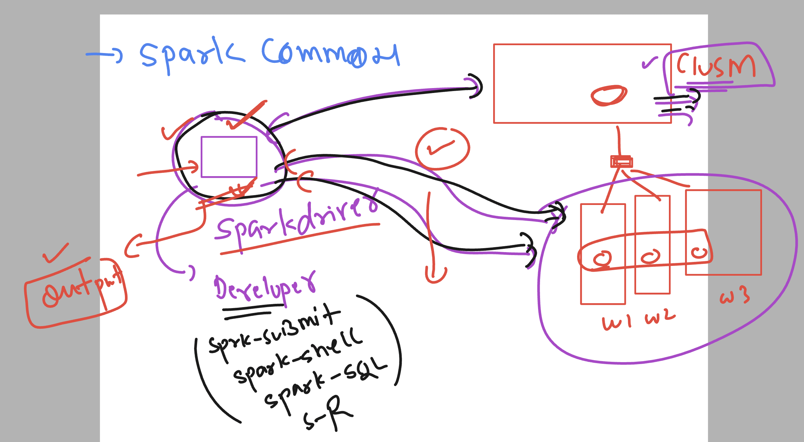

### deployment modes in spark 

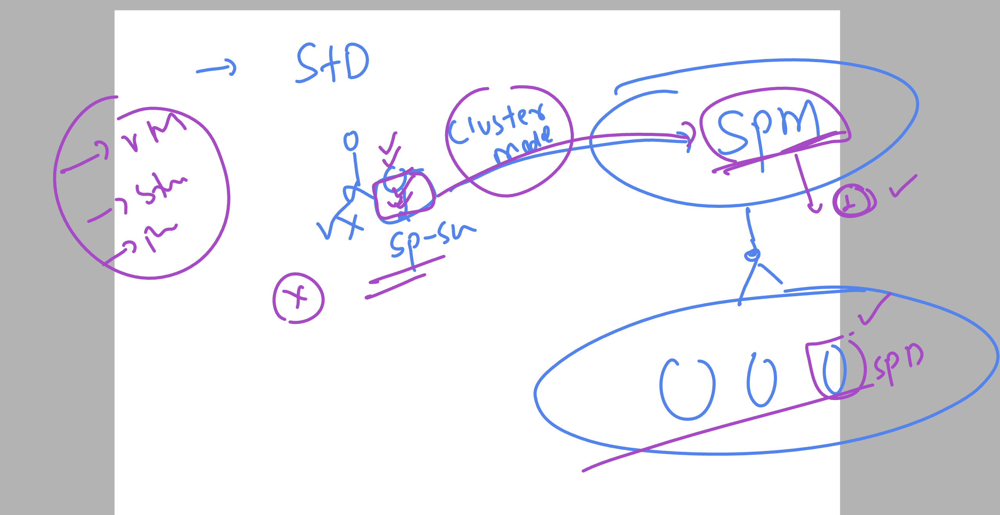

### verify k8s connection 

```
kubectl  get nodes
NAME                              STATUS   ROLES    AGE    VERSION
ip-192-168-101-209.ec2.internal   Ready    <none>   104m   v1.29.8-eks-a737599
ip-192-168-113-166.ec2.internal   Ready    <none>   104m   v1.29.8-eks-a737599
ip-192-168-19-235.ec2.internal    Ready    <none>   2d3h   v1.29.8-eks-a737599
ip-192-168-51-6.ec2.internal      Ready    <none>   104m   v1.29.8-eks-a737599
ip-192-168-57-194.ec2.internal    Ready    <none>   26h    v1.29.8-eks-a737599
ip-192-168-65-27.ec2.internal     Ready    <none>   104m   v1.29.8-eks-a737599
ip-192-168-8-27.ec2.internal      Ready    <none>   104m   v1.29.8-eks-a737599
ip-192-168-88-127.ec2.internal    Ready    <none>   26h    v1.29.8-eks-a737599
[ec2-user@ashu-spark-machine ~]$ 

```

### in k8s spark is deployed as Statefulsets 

```
kubectl  get  sts
NAME                READY   AGE
jpmc-spark-master   1/1     18h
jpmc-spark-worker   8/8     18h
[ec2-user@ashu-spark-machine ~]$ 

```

### login to any pod to run spark-submit 

```
 kubectl  exec -it jpmc-spark-worker-0 -- bash 
I have no name!@jpmc-spark-worker-0:/opt/bitnami/spark$ 

===> cluster mode command 


spark-submit   --master spark://jpmc-spark-master-svc:7077 --deploy-mode cluster 
 --class org.apache.spark.examples.SparkPi examples/jars/spark-examples_2.12-3.5.1.jar 10 


24/10/09 05:36:45 INFO SecurityManager: Changing view acls to: spark
24/10/09 05:36:45 INFO SecurityManager: Changing modify acls to: spark
24/10/09 05:36:45 INFO SecurityManager: Changing view acls groups to: 
24/10/09 05:36:45 INFO SecurityManager: Changing modify acls groups to: 
24/10/09 05:36:45 INFO SecurityManager: SecurityManager: authentication disabled; ui acls disabled; users with view permissions: spark; groups with view permissions: EMPTY; users with modify permissions: spark; groups with modify permissions: EMPTY
24/10/09 05:36:45 WARN NativeCodeLoader: Unable to load native-hadoop library for your platform... using builtin-java classes where applicable
24/10/09 05:36:46 INFO Utils: Successfully started service 'driverClient' on port 41079.
24/10/09 05:36:46 INFO TransportClientFactory: Successfully created connection to jpmc-spark-master-svc/10.100.145.116:7077 after 95 ms (0 ms spent in bootstraps)
24/10/09 05:36:47 INFO ClientEndpoint: ... waiting before polling master for driver state
24/10/09 05:36:47 INFO ClientEndpoint: Driver successfully submitted as driver-20241009053647-0002
24/10/09 05:36:52 INFO ClientEndpoint: State of driver-20241009053647-0002 is RUNNING
24/10/09 05:36:52 INFO ClientEndpoint: Driver running on 192.168.73.250:41027 (worker-20241009034737-192.168.73.250-41027)
24/10/09 05:36:52 INFO ClientEndpoint: spark-submit not configured to wait for completion, exiting spark-submit JVM.
24/10/09 05:36:52 INFO ShutdownHookManager: Shutdown hook called
24/10/09 05:36:52 INFO ShutdownHookManager: Deleting directory /tmp/spark-aaf5011e-c6aa-4ee2-becf-571628e9e05f

```

### in general also command 

```
spark-submit  --class com.example.Ashucode1 --deploy-mode cluster  target/ashucode1-1.0-SNAPSHOT.jar 

```

### Introducing spark sql 


### Understanding dataframes in spark sql 

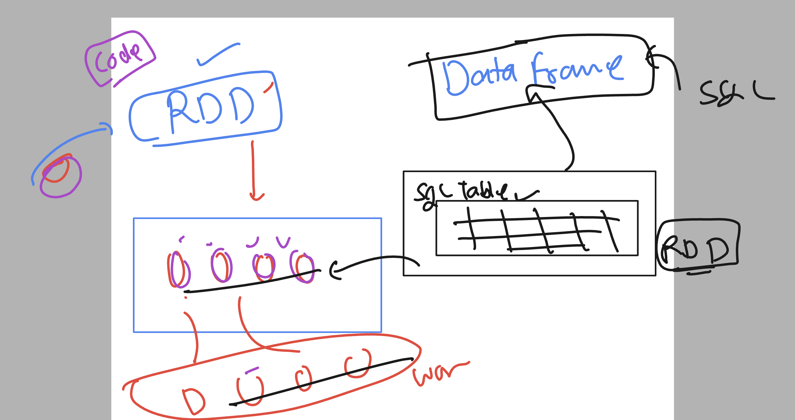

### starting standalone spark 

```
sudo chmod 777 /opt/spark35/ -R 

===>
start-master.sh 

starting org.apache.spark.deploy.master.Master, logging to /opt/spark35/logs/spark-ec2-user-org.apache.spark.deploy.master.Master-1-ashu-spark-machine.out


[ec2-user@ashu-spark-machine ~]$ netstat -nltp
(Not all processes could be identified, non-owned process info
 will not be shown, you would have to be root to see it all.)
Active Internet connections (only servers)
Proto Recv-Q Send-Q Local Address           Foreign Address         State       PID/Program name    
tcp        0      0 0.0.0.0:22              0.0.0.0:*               LISTEN      -                   
tcp        0      0 127.0.0.1:39893         0.0.0.0:*               LISTEN      -                   
tcp6       0      0 :::8080                 :::*                    LISTEN      13869/java          
tcp6       0      0 172.31.33.162:7077      :::*                    LISTEN      13869/java          
tcp6       0      0 :::22                   :::*                    LISTEN     

 -                   
[ec2-user@ashu-spark-machine ~]$ start-worker.sh  172.31.33.162:7077 
starting org.apache.spark.deploy.worker.Worker, logging to /opt/spark35/logs/spark-ec2-user-org.apache.spark.deploy.worker.Worker-1-ashu-spark-machine.out


[ec2-user@ashu-spark-machine ~]$ jps
13944 Worker
14012 Jps
13869 Master


[ec2-user@ashu-spark-machine ~]$ netstat -nlpt
(Not all processes could be identified, non-owned process info
 will not be shown, you would have to be root to see it all.)
Active Internet connections (only servers)
Proto Recv-Q Send-Q Local Address           Foreign Address         State       PID/Program name    
tcp        0      0 0.0.0.0:22              0.0.0.0:*               LISTEN      -                   
tcp        0      0 127.0.0.1:39893         0.0.0.0:*               LISTEN      -                   
tcp6       0      0 :::8080                 :::*                    LISTEN      13869/java          
tcp6       0      0 :::8081                 :::*                    LISTEN      13944/java          
tcp6       0      0 172.31.33.162:7077      :::*                    LISTEN      13869/java          
tcp6       0      0 172.31.33.162:39859     :::*                    LISTEN      13944/java          
tcp6       0      0 :::22                   :::*                    LISTEN      -                   
[ec2-user@ashu-spark-machine ~]$ 

```

### spark sql use cases

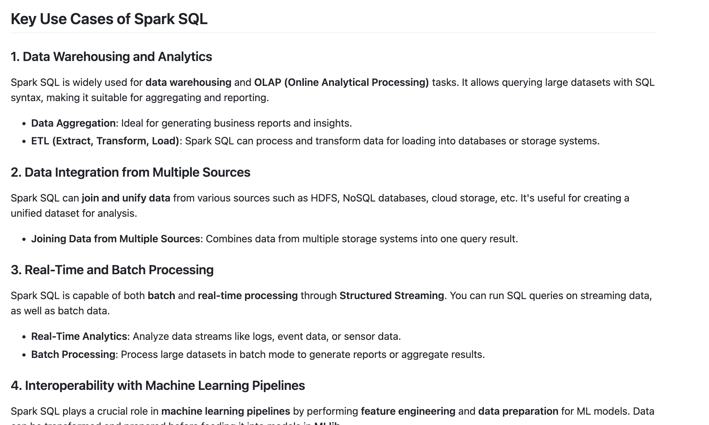

## connecting using spark-sql

```
ec2-user@ashu-spark-machine ~]$ spark-sql
Setting default log level to "WARN".
To adjust logging level use sc.setLogLevel(newLevel). For SparkR, use setLogLevel(newLevel).
24/10/09 06:46:15 WARN NativeCodeLoader: Unable to load native-hadoop library for your platform... using builtin-java classes where applicable
24/10/09 06:46:18 WARN HiveConf: HiveConf of name hive.stats.jdbc.timeout does not exist
24/10/09 06:46:18 WARN HiveConf: HiveConf of name hive.stats.retries.wait does not exist
24/10/09 06:46:22 WARN ObjectStore: Version information not found in metastore. hive.metastore.schema.verification is not enabled so recording the schema version 2.3.0
24/10/09 06:46:22 WARN ObjectStore: setMetaStoreSchemaVersion called but recording version is disabled: version = 2.3.0, comment = Set by MetaStore ec2-user@172.31.33.162
24/10/09 06:46:22 WARN ObjectStore: Failed to get database default, returning NoSuchObjectException
Spark Web UI available at http://ip-172-31-33-162.ap-south-1.compute.internal:4040
Spark master: local[*], Application Id: local-1728456377181
spark-sql (default)> 

```

### inside spark-sql --some queries

```
show databases;
default
Time taken: 1.358 seconds, Fetched 1 row(s)
spark-sql (default)> 

===>
 create  database ashudb;

 ===>
 show databases;
ashudb
default
Time taken: 0.044 seconds, Fetched 2 row(s)

===>
select current_database();
ashudb
Time taken: 0.958 seconds, Fetched 1 row(s)
spark-sql (ashudb)> 
===>

 create table  ashu_info1 (
                  > id INT ,
                  > name STRING,
                  > email STRING
                  > );

===>
show tables;
ashu_info1
Time taken: 0.198 seconds, Fetched 1 row(s)

===>

spark-sql (ashudb)> show tables in ashudb;
ashu_info1

===>
desc ashu_info1;
id                      int                                         
name                    string                                      
email                   string                                      
Time taken: 0.344 seconds, Fetched 3 row(s)

===>
insert into ashu_info1 
                  > values 
                  > (2,'jack','jack@linux.com'),
                  > (3,'harry','h@ok.com');

====>

 create table addr_info (
                  > id INT,
                  > address STRING
                  > );


===>

insert into addr_info 
                  > values 
                  > (1,'123 main st jaipur'),
                  > (2,'4/292 backyard hydr'),
                  > (3,' 5/89 kormangla bangalore');

===>>

 select * from addr_info;
2       4/292 backyard hydr
3        5/89 kormangla bangalore
1       123 main st jaipur
Time taken: 0.168 seconds, Fetched 3 row(s)
spark-sql (ashudb)> 
                  > select * from ashu_info1;
1       ashu    ashu@linux.com
3       harry   h@ok.com
2       jack    jack@linux.com
Time taken: 0.151 seconds, Fetched 3 row(s)

===>>
JOin operation on field 

select  t1.id , t1.name , t1.email , t2.address
                  > FROM ashu_info1 t1 
                  > JOIN addr_info  t2
                  > ON t1.id = t2.id ;


2       jack    jack@linux.com  4/292 backyard hydr
3       harry   h@ok.com         5/89 kormangla bangalore
1       ashu    ashu@linux.com  123 main st jaipur
Time taken: 0.828 seconds, Fetched 3 row(s)

```

### please use above day3 java code with apache maven to build and submit using spark 

```
spark-submit --class com.example.Demosql1 target/demosql1-1.0-SNAPSHOT.jar 

```

## Pyspark 

### install python lib for pyspark support 

```
sudo yum install python3-pip 
pip3  install py4j numpy 

```
## some info about pyspark 

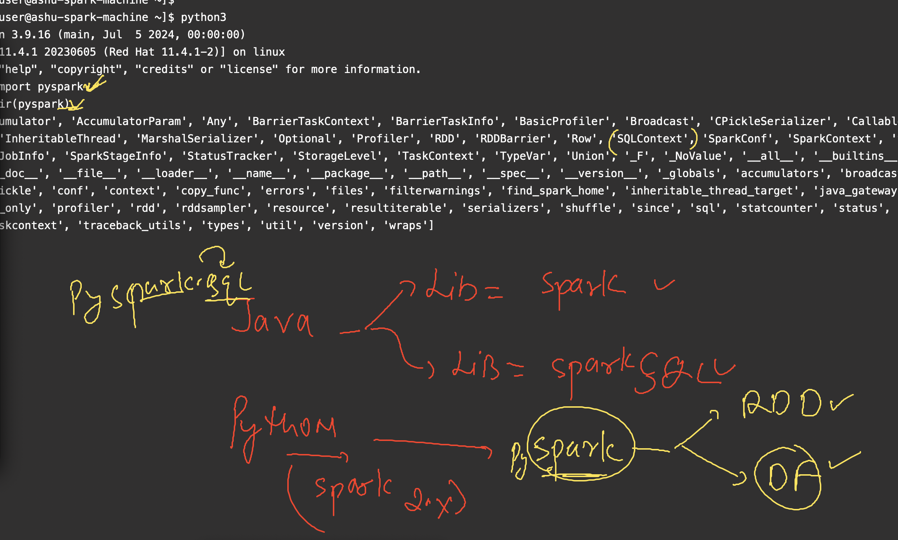


### pyspark for word count 

```
pyspark
Python 3.9.16 (main, Jul  5 2024, 00:00:00) 
[GCC 11.4.1 20230605 (Red Hat 11.4.1-2)] on linux
Type "help", "copyright", "credits" or "license" for more information.
Setting default log level to "WARN".
To adjust logging level use sc.setLogLevel(newLevel). For SparkR, use setLogLevel(newLevel).
24/10/09 09:38:19 WARN NativeCodeLoader: Unable to load native-hadoop library for your platform... using builtin-java classes where applicable
Welcome to
      ____              __
     / __/__  ___ _____/ /__
    _\ \/ _ \/ _ `/ __/  '_/
   /__ / .__/\_,_/_/ /_/\_\   version 3.5.3
      /_/

Using Python version 3.9.16 (main, Jul  5 2024 00:00:00)
Spark context Web UI available at http://ip-172-31-33-162.ap-south-1.compute.internal:4040
Spark context available as 'sc' (master = local[*], app id = local-1728466700558).
SparkSession available as 'spark'.
>>> df=sc.textFile("file:///home/ec2-user/data.txt")
>>> df.first()
'hello world this jpmc spark serssion '                                         
>>> df.take(4)
['hello world this jpmc spark serssion ', 'hello world this jpmc spark serssion ', 'hello world this jpmc spark serssion ', 'hello world this jpmc spark serssion ']
>>> 

```

### spark core to spark SQL engine 

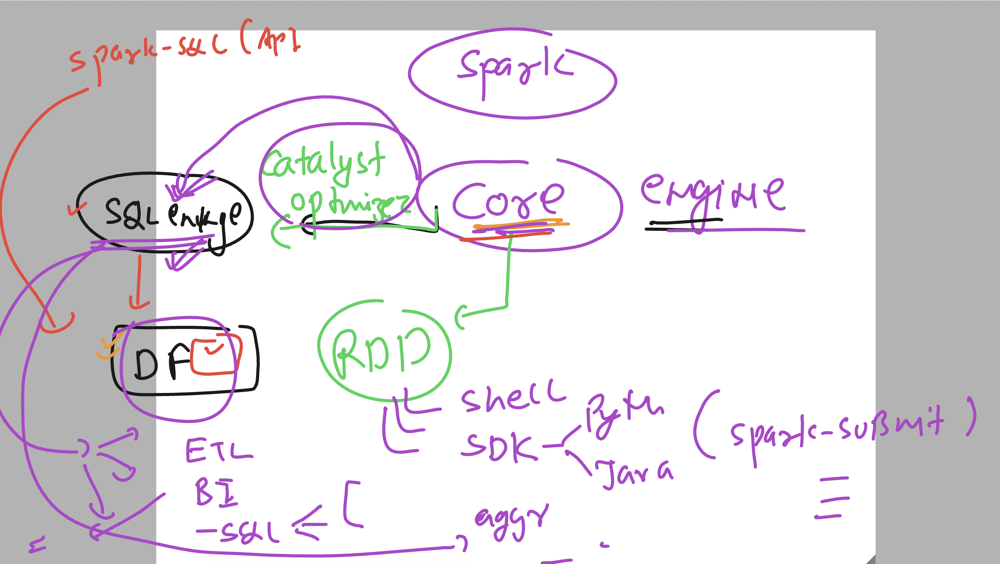

### spark cluster more info 

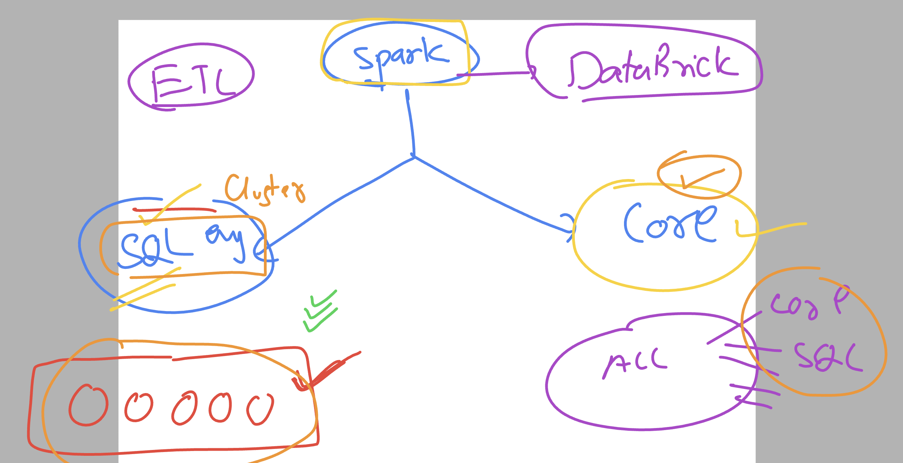

## ML category 

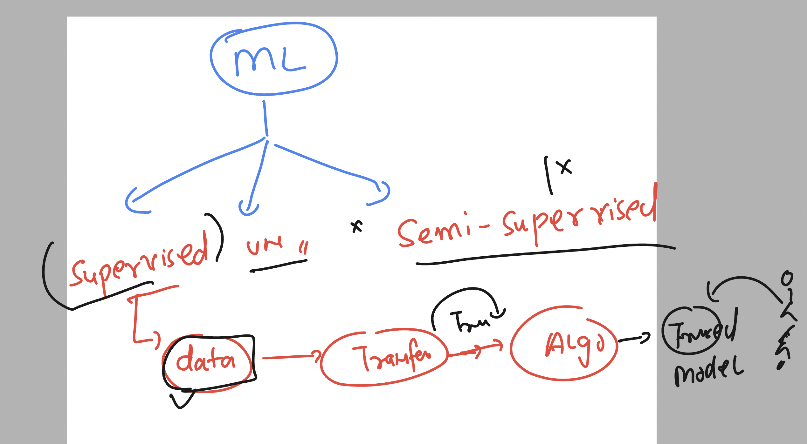

### Inderstanding spark Mlib 

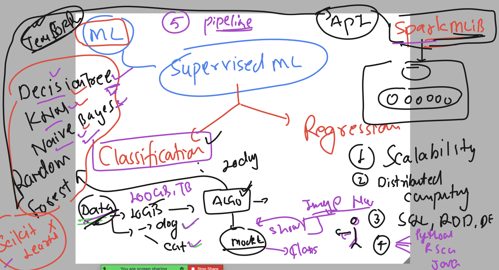

### spark MLlib + kubeflow 

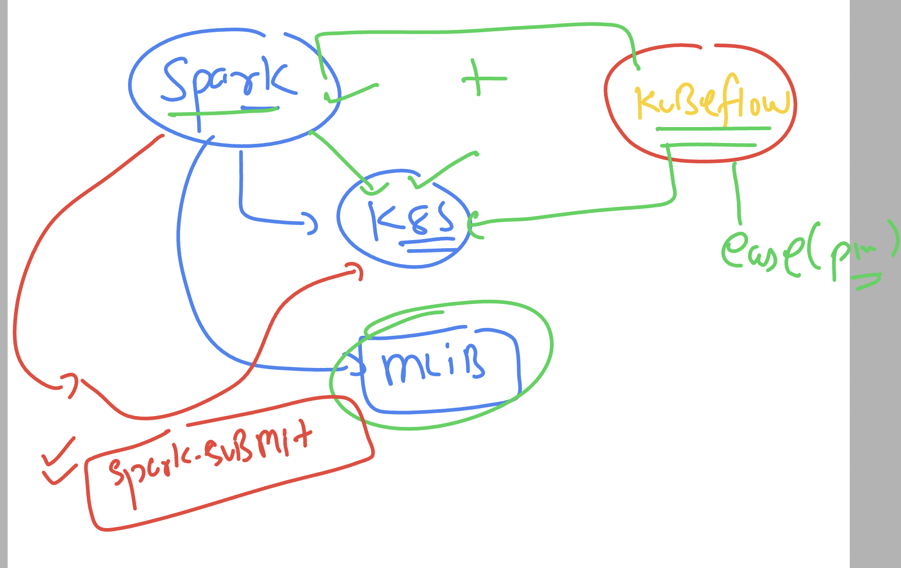

### Regression in ML 

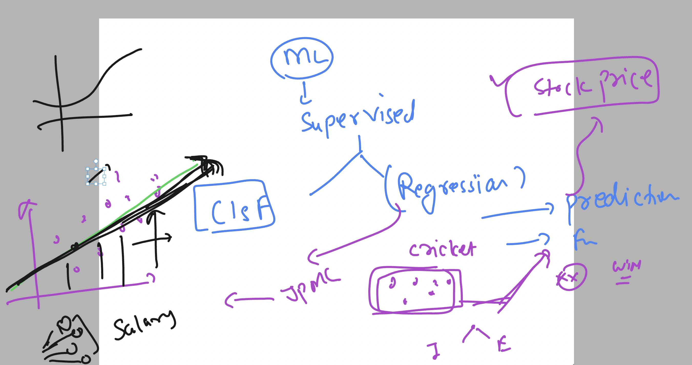

### AI models 

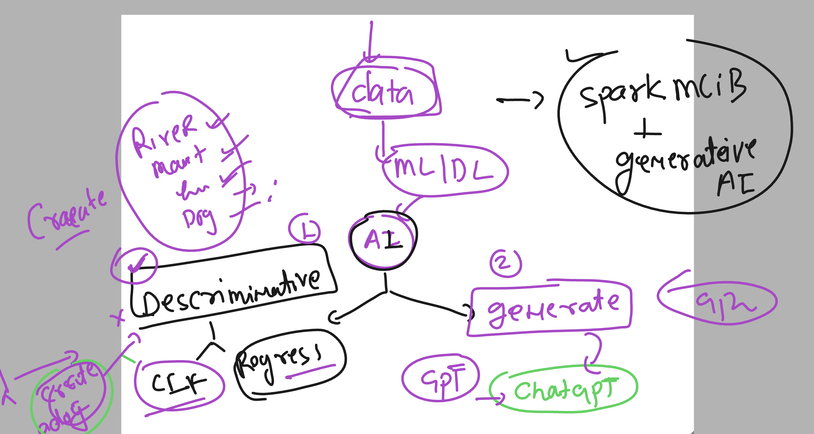

